# Hi 👋, I'm Ali

  🚀 <strong>Open Source Contributor | Problem Solver | Developer Tools Enthusiast</strong>

---

### 📊 GitHub Metrics Dashboard

<!-- Row 1: Header (left) + Activity (right) -->

<table>
  <tr>
    <td width="62%" valign="top">
      
    </td>
    <td width="38%" valign="top">
      
    </td>
  </tr>
</table>

<!-- Row 2: Follow-up (Issues/PRs created by me) -->

  

<!-- Row 3: Languages (Most used + Recently used) -->

  

⏱️ Auto‑updated every 6 hours and on push via <code>lowlighter/metrics</code>. See <code>.github/workflows/metrics.yml</code>.
