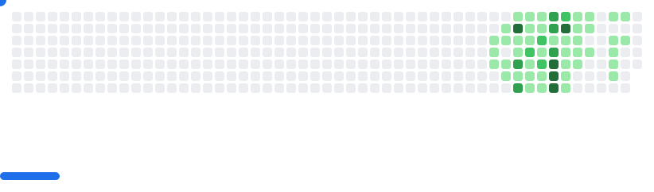

# Hi 👋, I'm Ali

  🚀 <strong>Open Source Contributor · Problem Solver · Developer Tools Enthusiast</strong>
    
  
  <!-- Badges -->
  

---

## 📊 GitHub Metrics Dashboard

<!-- Row 1: Header (left) + Activity (right) -->
<table>
  <tr>
    <td width="62%" valign="top">
      
    </td>
    <td width="38%" valign="top">
      
    </td>
  </tr>
</table>

<!-- Row 2: Follow-up (Issues/PRs created by me) -->

  

<!-- Row 3: Languages (Most used + Recently used) -->

  

---

## 🎮 Breakout — Your Contributions as a Game

  <picture>
    <source media="(prefers-color-scheme: dark)" srcset="images/breakout-dark.svg" />
    <source media="(prefers-color-scheme: light)" srcset="images/breakout-light.svg" />
    
  </picture>

---

⏱️ Auto-updated every 6 hours and on push via <code>lowlighter/metrics</code>. See <code>.github/workflows/metrics.yml</code>. Breakout SVGs are generated on schedule via <code>cyprieng/github-breakout</code>.
